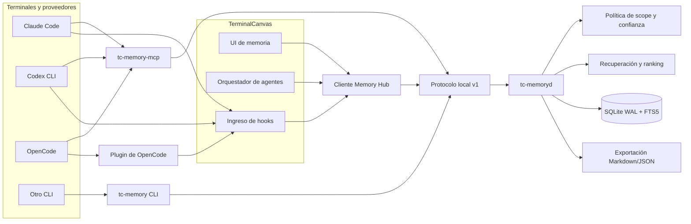
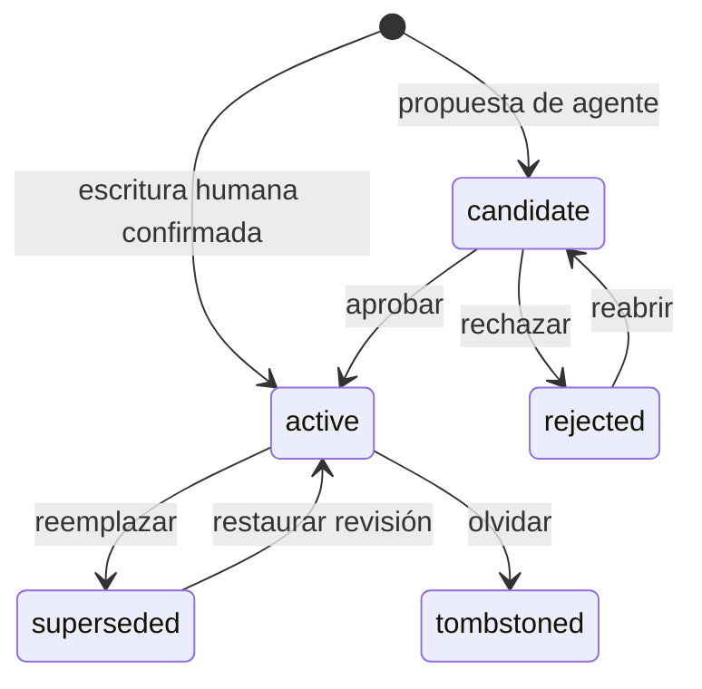
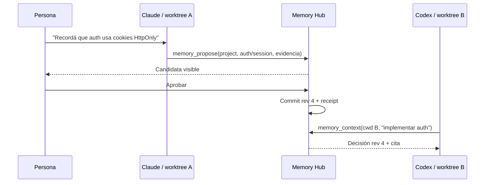

# Memoria compartida multiagente de TerminalCanvas

Estado: núcleo MVP implementado; integración automática multiproveedor todavía parcial\
Fecha de investigación: 2026-08-12\
Alcance: Claude Code, Codex CLI, OpenCode y otros agentes ejecutados en terminales de TerminalCanvas

## Estado de implementación

El repositorio ya incluye el primer corte funcional: store local SQLite en modo
WAL, revisiones e idempotencia, aislamiento por proyecto/worktree, contexto
acotado, handoffs, redacción básica de secretos, UI, `tc-memory`,
`tc-memory-mcp` e inyección fail-open en lanzamientos y hooks de Claude. El
bridge MCP queda atado al proyecto/worktree confiable del proceso mediante
`TC_MEMORY_ROOT`, y los scopes de workspace usan el UUID real de la app cuando
está disponible. Las escrituras humanas quedan activas; las propuestas de
agentes permanecen como candidatas hasta ser aprobadas.

La arquitectura completa descrita abajo sigue siendo el objetivo. En especial,
el MVP todavía usa la serialización transaccional de SQLite entre procesos; no
incluye `tc-memoryd` como único escritor, memory spaces, recuperación semántica,
importadores de proveedores ni sincronización remota. Tampoco registra todavía
el MCP ni hooks de forma automática en Codex u OpenCode; esos proveedores sí
reciben el contexto inicial cuando TerminalCanvas los lanza, pero la consulta
dinámica requiere configuración manual hasta completar los adaptadores de la
Fase 2. Esas piezas no deben presentarse como ya entregadas.

### Contratos de persistencia y recuperación implementados

La versión 2 del esquema migra de forma transaccional y conserva memorias,
revisiones y handoffs. Un UUID explícito identifica una tarea dentro de su
proyecto, aunque otras tareas usen el mismo directorio. Las llamadas sin UUID
mantienen la identidad histórica por cwd/worktree. Si una base anterior ya
vinculaba ese directorio a un UUID, ese UUID sigue leyendo su historial; la
migración no puede reconstruir tareas que antes quedaron mezcladas. Al vincular
proyectos se conservan ambos historiales y las memorias incompatibles quedan
como candidatas para revisión humana.

`TC_MEMORY_TASK_ID` configura el UUID del proceso MCP y sirve de valor por
defecto para el CLI; `tc-memory --task UUID` lo reemplaza explícitamente. Un
valor configurado inválido provoca un error, sin caer en la tarea por cwd. El
servidor MCP lee el valor al iniciar y las herramientas no pueden sustituirlo
con argumentos. La app debe pasar la misma identidad al contexto inicial y al
PTY para que consultas y handoffs pertenezcan a la misma tarea. Sin la variable,
los clientes manuales conservan el comportamiento anterior. `TC_MEMORY_ROOT`
sigue delimitando el proyecto/worktree autorizado.

La deduplicación compara el texto preparado exactamente: conserva mayúsculas,
indentación, espacios y saltos de línea. La redacción sustituye solamente los
fragmentos reconocidos, incluidos valores entre comillas y claves privadas,
sin reescribir el código restante. Es una detección local de patrones, no una
garantía de detectar cualquier secreto. Se aplica a nuevas escrituras y no
reescribe contenido ni revisiones históricas. Las respuestas de propuestas MCP
contienen identificadores y estado de la propuesta, sin revelar el contenido
de otra candidata cuando hay conflicto.

La recuperación tiene límites explícitos:

- Contexto: hasta 32 elementos y 2400 unidades estimadas, con 800 para core y
  400 para el handoff. Cada unidad admite cuatro bytes UTF-8 y se cuenta el
  mayor tamaño entre el bloque inyectable y el JSON completo, incluidos
  metadatos, escapes y cursor. Es un límite de tamaño, no un tokenizador del
  proveedor. Un handoff largo se recorta en un límite Unicode seguro; si sus
  metadatos solos exceden el límite se omite del contexto.
- Candidatos de contexto: hasta las 32 entradas activas más recientes por
  scope, ampliables mediante una consulta explícita. Las entradas restantes
  siguen persistidas y accesibles mediante búsqueda o exportación.
- Búsqueda: hasta 100 registros completos y 512 KiB de JSON, con consultas de
  hasta 512 caracteres y 32 términos FTS. El filtro de scope se aplica en SQL
  antes del límite. Una consulta amplia debe refinarse si requiere recuperar
  otras entradas; la búsqueda no promete enumerar toda la base.
- Listado humano y exportación: conservan el contenido completo de los scopes
  seleccionados; el CLI aplica también el UUID configurado a pending/export.

Estos contratos se verifican con fixtures sintéticos de migración, tareas que
comparten cwd, secretos entre comillas, cambios de case/espacios, aislamiento
FTS y presupuestos con metadatos y Unicode.

## Resumen ejecutivo

TerminalCanvas incorpora un primer **Memory Hub local y propio** y apunta a
consolidarlo detrás de una única autoridad de escritura. SQLite, FTS5, historial
de revisiones y las interfaces neutrales ya forman parte del MVP; el daemon de
escritura único pertenece a la siguiente etapa.

La memoria no debe pertenecer a Claude, Codex ni OpenCode. Cada proveedor será un cliente del mismo servicio mediante:

- MCP para consultar y proponer memoria;
- hooks o plugins para eventos de sesión;
- una CLI como fallback universal;
- la UI de TerminalCanvas para revisar, aprobar, corregir, olvidar y auditar.

La decisión central es:

> SQLite es la fuente de verdad transaccional; el daemon de memoria es el único escritor; Markdown es una proyección exportable y auditable, no el mecanismo de concurrencia.

Esto permite que varias terminales, incluso con proveedores distintos, compartan conocimiento sin compartir procesos, historiales privados ni formatos internos. Una memoria confirmada en Claude queda disponible para Codex u OpenCode en su **próxima recuperación o frontera de prompt**. No se intenta modificar a escondidas el contexto de un modelo que ya está generando una respuesta.

## Aclaración sobre “Open Cloud”

En esta investigación se interpreta “Open Cloud” como **OpenClaw**, porque su arquitectura pública de memoria coincide con el contexto del pedido. También se estudió **OpenCode**, que sí aparece explícitamente entre los proveedores de terminal. Si el nombre hacía referencia a otro repositorio, se puede sumar como una comparación adicional sin cambiar el diseño base.

## Problema que resolvemos

Hoy cada agente opera dentro de su propio silo:

- Claude Code mantiene sesiones, configuración y memoria en formatos propios;
- Codex tiene su configuración, sesiones, `AGENTS.md`, MCP y hooks;
- OpenCode expone su propio servidor, plugins y sesiones;
- otros CLIs pueden tener solamente stdin/stdout y archivos de instrucciones.

Compartir esos directorios internos entre procesos no constituye una memoria común. Introduce incompatibilidades de formato, escrituras concurrentes, falta de procedencia y acoplamiento a versiones privadas de cada proveedor.

El sistema buscado debe resolver cuatro necesidades distintas:

1. **Contexto durable:** decisiones, preferencias, restricciones y procedimientos que siguen siendo válidos.
2. **Continuidad de tarea:** qué se hizo, qué falta y dónde continuar entre terminales o proveedores.
3. **Recuperación:** encontrar episodios pasados sin inyectar todo el historial en cada prompt.
4. **Gobierno:** saber quién creó cada dato, de dónde salió, qué versión está activa y cómo olvidarlo.

### Semántica de “compartida”

Una escritura confirmada tiene consistencia inmediata dentro del Memory Hub. Los demás clientes la pueden leer en la siguiente consulta.

La integración con un agente tiene límites reales:

- antes de un prompt, un hook puede agregar un paquete de contexto actualizado;
- durante una sesión, el agente puede consultar MCP a demanda;
- al compactar, detenerse o cerrar, un hook puede registrar un episodio o handoff;
- durante una respuesta que ya está en curso, TerminalCanvas no debe alterar silenciosamente el contexto del modelo.

La UI puede avisar que existe memoria nueva, pero la incorporación ocurre en una frontera segura y observable.

## Objetivos y no objetivos

### Objetivos

- compartir memoria entre terminales y proveedores dentro de TerminalCanvas;
- aislar proyectos por defecto y permitir memoria global o entre proyectos seleccionados sólo de forma explícita;
- hacer que distintos worktrees del mismo repositorio compartan identidad de proyecto sin mezclar su estado de tarea;
- soportar varias escrituras concurrentes sin perder datos;
- conservar fuente, sesión, proveedor, confianza, revisiones y recibos de cada mutación;
- ofrecer búsqueda rápida sin exigir embeddings ni servicios externos;
- degradar sin bloquear el agente cuando la memoria no esté disponible;
- permitir inspección, exportación y borrado desde la aplicación.

### No objetivos del MVP

- duplicar íntegramente los historiales de cada proveedor;
- tratar el scrollback crudo de una terminal como memoria confiable;
- promover automáticamente todo lo que dice un agente a memoria global;
- requerir un vector database o una API de embeddings;
- sincronizar dispositivos por Internet;
- abrir el archivo SQLite directamente desde cada agente;
- reemplazar el sistema de sesiones o el daemon de PTY existente;
- construir todavía una red general de mensajería agente-a-agente.

## Punto de partida en TerminalCanvas

El repositorio ya tiene varias piezas que reducen mucho el trabajo de integración:

- `src/daemon/protocol.rs` define un protocolo NDJSON versionado sobre socket local, autenticado con un token propietario;
- `src/daemon/server.rs` ya implementa el patrón supervisor local y mantiene sesiones desacopladas de la UI;
- `src/runtime/session.rs` transporta `workspace_id`, `panel_id`, `cwd` y comando de inicio;
- `src/terminal/pty.rs` exporta `TC_PANEL_ID` y `TC_WORKSPACE_ID` a cada terminal;
- `src/orchestration/manager.rs` reconoce Claude Code, Codex CLI, OpenCode y otros proveedores, y construye sus comandos de lanzamiento;
- `src/orchestration/hook_server.rs` recibe eventos locales autenticados y los normaliza con proveedor, panel, workspace y sesión;
- `src/orchestration/claude_hooks.rs` instala hooks propios sin borrar los hooks del usuario;
- `src/orchestration/agent_sessions.rs` mantiene una frontera correcta: descubre historiales del proveedor, pero no los copia como estado propio.

Estas piezas deben reutilizar sus patrones, no fusionar responsabilidades. La memoria tiene persistencia, migraciones y ciclo de vida diferentes al de un PTY. Por eso se propone un daemon lógico separado del daemon de terminales.

### Brechas que siguen abiertas después del primer corte

- todavía no existe `tc-memoryd` como autoridad única de escritura, con socket,
  lock de proceso, suscripciones y backups administrados;
- faltan `memory spaces` y los scopes `user`, `space`, `session` y `panel`;
- la instalación dinámica de ciclo de vida sólo está administrada para Claude;
  Codex y OpenCode requieren por ahora registro manual del MCP;
- la UI mínima todavía no expone historial completo, fuentes, diff, restauración,
  exportación ni estado de inclusión por panel;
- no existen aún importadores de proveedores, recuperación semántica ni
  sincronización remota.

## Investigación comparativa

Las referencias principales se inspeccionaron en estos snapshots:

| Proyecto | Snapshot | Qué aporta |
|---|---|---|
| [Prime Agent](https://github.com/PrimeIntellect-ai/prime-agent/tree/0987c1ba7637cbcb99afe9efe1180b838a0aa958) | `0987c1b` | daemon supervisor, workers por árbol de sesión, journal, leases, estado durable del harness |
| [Hermes Agent](https://github.com/NousResearch/hermes-agent/tree/c5097da12b6eea6895873ae3f696721e95559534) | `c5097da` | memoria curada pequeña, historial FTS5, proveedores de memoria, aprobación y seguridad de escritura |
| [OpenClaw](https://github.com/openclaw/openclaw/tree/93cf912695e0616ce60a565689d25b971f576bd7) | `93cf912` | capas de memoria, procedencia, promoción controlada, búsqueda híbrida, reportes de revisión |
| [OpenCode](https://github.com/anomalyco/opencode/tree/cc4b45612974f735ddec46009ede07729511fba4) | `cc4b456` | arquitectura cliente-servidor, MCP y eventos de plugins para integrar ciclos de sesión |

### Prime Agent

Prime Agent separa la terminal visible del supervisor y de los workers que poseen las sesiones. Su arquitectura de daemon usa adjuntos recuperables, workers por árbol raíz, leases para evitar escritores simultáneos y comandos idempotentes. El protocolo incluye cursores de generación/secuencia y un journal append-only para recuperación.

El Continual Harness guarda prompts suplementarios, memoria, skills y especificaciones de subagentes como estado durable. Sus entradas tienen tipo, scope, fuente, timestamps y versión; además recarga si detecta cambios externos para reducir clobbering. `/refine` aplica cambios pequeños con evidencia y rollback.

Lecciones adoptadas:

- separar presentación, supervisor y dueño de estado;
- identificar comandos mutantes con `client_id + request_id`;
- versionar cada entrada y soportar rollback;
- usar sesiones/leases para impedir que varios procesos crean ser la autoridad;
- mantener pequeño y explícito el contexto persistente.

Límite de la referencia: el harness basado en archivos JSON es útil como modelo conceptual, pero no alcanza como núcleo multiwriter de TerminalCanvas.

Referencias: [arquitectura](https://github.com/PrimeIntellect-ai/prime-agent/blob/0987c1ba7637cbcb99afe9efe1180b838a0aa958/packages/coding-agent/docs/architecture.md), [daemon](https://github.com/PrimeIntellect-ai/prime-agent/blob/0987c1ba7637cbcb99afe9efe1180b838a0aa958/packages/coding-agent/docs/daemon.md), [harness](https://github.com/PrimeIntellect-ai/prime-agent/blob/0987c1ba7637cbcb99afe9efe1180b838a0aa958/prime-agent-runtime/src/rlm/harness.py).

### Hermes Agent

Hermes hace una distinción especialmente valiosa:

- `MEMORY.md` y `USER.md` forman un núcleo curado, pequeño y cargado al comienzo de la sesión;
- `state.db` almacena historiales amplios y los busca con SQLite FTS5;
- un proveedor externo puede prebuscar contexto, sincronizar turnos y exponer herramientas;
- las escrituras pueden quedar pendientes de aprobación;
- las operaciones de memoria son add/replace/remove, con límites, deduplicación y escaneo de seguridad.

Su documentación advierte que dos agentes no deben apuntar al mismo home de Hermes: aun con locks, los escritores independientes pueden producir cambios compuestos o sobrescrituras. Para memoria realmente compartida recomienda un proveedor externo. Ésta es evidencia directa contra la idea de compartir `MEMORY.md` entre nuestras terminales.

Lecciones adoptadas:

- separar memoria curada de historial recuperable;
- congelar un paquete inicial para no destruir el prompt cache en cada turno;
- hacer que los fallos del proveedor sean no fatales;
- permitir propuestas pendientes y aprobación humana;
- filtrar inyección, exfiltración e Unicode invisible antes de guardar;
- abstraer la memoria detrás de una interfaz independiente del agente.

Referencias: [guía de memoria](https://github.com/NousResearch/hermes-agent/blob/c5097da12b6eea6895873ae3f696721e95559534/website/docs/user-guide/features/memory.md), [memory provider](https://github.com/NousResearch/hermes-agent/blob/c5097da12b6eea6895873ae3f696721e95559534/agent/memory_provider.py), [memory manager](https://github.com/NousResearch/hermes-agent/blob/c5097da12b6eea6895873ae3f696721e95559534/agent/memory_manager.py), [memory tool](https://github.com/NousResearch/hermes-agent/blob/c5097da12b6eea6895873ae3f696721e95559534/tools/memory_tool.py), [session search](https://github.com/NousResearch/hermes-agent/blob/c5097da12b6eea6895873ae3f696721e95559534/tools/session_search_tool.py).

### OpenClaw

OpenClaw modela memoria en capas:

1. perfil estable del usuario;
2. núcleo durable curado;
3. notas episódicas por fecha;
4. superficie de revisión y consolidación.

Su arquitectura pone énfasis en que la parte difícil no es buscar, sino decidir qué escribir. Clasifica la procedencia, separa contenido confiable de contenido observado y usa gates determinísticos antes de cualquier consolidación asistida por un modelo. El contenido de cron, subagentes o fuentes no confiables no puede promocionarse automáticamente. También marca el contexto recuperado para evitar bucles donde una memoria se vuelve a guardar por haber sido recordada.

La búsqueda combina palabras clave y vectores cuando están disponibles, favorece identificadores exactos, aplica diversidad y puede considerar proyecto, importancia y decaimiento temporal. Sus reconstrucciones de índice usan una base shadow y publicación transaccional.

Lecciones adoptadas:

- separar instrucciones humanas, núcleo, episodios y revisión;
- tratar la escritura como una frontera de seguridad;
- guardar procedencia y clase de confianza de forma inmutable;
- impedir auto-promoción desde contenido no confiable;
- citar el origen y explicar por qué se recuperó cada entrada;
- empezar con FTS5 y dejar la búsqueda semántica como mejora opcional.

Límite de la referencia: la consolidación tipo “dreaming”, grafos y embeddings agregan complejidad que no es necesaria para validar el MVP.

Referencias: [concepto de memoria](https://github.com/openclaw/openclaw/blob/93cf912695e0616ce60a565689d25b971f576bd7/docs/concepts/memory.md), [arquitectura](https://github.com/openclaw/openclaw/blob/93cf912695e0616ce60a565689d25b971f576bd7/docs/concepts/memory-architecture.md), [búsqueda híbrida](https://github.com/openclaw/openclaw/blob/93cf912695e0616ce60a565689d25b971f576bd7/extensions/memory-core/src/memory/hybrid.ts).

### OpenCode

OpenCode ya funciona como cliente y servidor. Expone sesiones mediante una API y permite ejecutar un servidor headless. Sus plugins reciben eventos de sesión, compactación, mensajes, herramientas y cambios de estado; además soporta MCP local y remoto.

Esto lo convierte en un buen huésped para el Memory Hub, pero no en la autoridad de memoria. Leer directamente sus archivos o base interna acoplaría TerminalCanvas a una implementación que puede cambiar.

Integración recomendada:

- MCP para `context`, `search`, `get`, `propose` y `handoff`;
- plugin de OpenCode para registrar creación, compactación, idle y cierre de sesión;
- API pública del servidor cuando se necesite reconciliar sesiones, nunca introspección del storage privado.

Referencias: [servidor](https://opencode.ai/docs/server/), [plugins](https://opencode.ai/docs/plugins/), [MCP](https://opencode.ai/docs/mcp-servers/).

### Codex y Claude Code

Codex soporta servidores MCP stdio y HTTP compartidos entre CLI, IDE y aplicación mediante su configuración. También dispone de hooks de ciclo de vida; `SessionStart` puede devolver contexto adicional y eventos como prompt, compactación, stop y fin de sesión permiten sincronizar sin leer la conversación en tiempo real. `AGENTS.md` sirve como instrucción estática por capas, pero se carga al inicio y no es una memoria viva.

La integración debe usar las APIs públicas de Codex y evitar depender del formato de transcript, que no se promete como API estable. Referencias oficiales: [MCP en Codex](https://developers.openai.com/codex/mcp/), [hooks de Codex](https://developers.openai.com/codex/hooks/), [descubrimiento de `AGENTS.md`](https://developers.openai.com/codex/guides/agents-md/).

Claude Code ofrece MCP y hooks equivalentes para inicio de sesión, prompt, compactación, stop y fin de sesión. Un detalle operativo importante es que un hook MCP de `SessionStart` puede ejecutarse antes de que el servidor MCP esté conectado; el bootstrap debe entrar por un hook command/HTTP o por el prompt de lanzamiento, y MCP queda para consultas posteriores. Referencias oficiales: [hooks de Claude Code](https://code.claude.com/docs/en/hooks), [MCP en Claude Code](https://code.claude.com/docs/en/mcp).

### Proyectos adyacentes

También existe una convergencia clara en proyectos más pequeños:

- [Engram Agent Memory](https://github.com/syntax-syndicate/engram-agent-memory) usa un binario neutral, SQLite/FTS5, MCP, HTTP y CLI para varios agentes;
- [codex-agent-mem](https://github.com/MarceloCaporale/codex-agent-mem) usa SQLite/FTS, paquetes de contexto y un bridge daemon/stdio;
- [Dory](https://github.com/deeflect/dory) combina daemon local, Markdown auditable, índice SQLite y MCP/CLI;
- [Seamless](https://thereisnospoon.org/docs/) combina memoria local y handoffs de coordinación;
- [Engram](https://github.com/semantic-craft/engram) usa servidor central, hooks/MCP, supersesión y una representación versionable.

Ninguno resuelve exactamente la integración visual, los scopes de TerminalCanvas y la identidad de worktrees. Sí validan el patrón repetido: **servicio local + interfaz neutral + datos inspeccionables + adaptadores de ciclo de vida**.

## Alternativas evaluadas

| Alternativa | Ventaja | Problema | Decisión |
|---|---|---|---|
| Compartir `MEMORY.md`/homes de proveedores | muy simple | carreras, formatos incompatibles, sin autoridad ni auditoría | descartada |
| SQLite abierto por cada agente | menos procesos | cada adapter debe migrar, bloquear y aplicar políticas correctamente | descartada |
| Markdown como fuente de verdad multiwriter | portable y Git-friendly | conflictos, metadatos complejos, difícil CAS y borrado seguro | no para el núcleo |
| Servicio cloud central | multi-dispositivo desde el día uno | privacidad, auth, latencia y operación antes de validar el producto | postergada |
| Daemon local único + SQLite + MCP/hooks/CLI | concurrencia controlada, neutral, auditable | requiere construir adapters y UI | elegida |

Markdown sigue siendo valioso como exportación determinística, backup legible e importación controlada. No debe ser el archivo que todos los procesos editan simultáneamente.

## Principios de diseño

1. **Una autoridad de escritura.** Todos los clientes mutan memoria a través del daemon.
2. **Aislamiento antes que conveniencia.** No se cruza información entre proyectos salvo scope global o un `memory space` explícito.
3. **La procedencia no se pierde.** Toda afirmación conserva fuente, sesión, proveedor y actor.
4. **Recordar no equivale a creer.** Una observación o propuesta no es memoria activa.
5. **La recuperación es acotada.** Se entrega un paquete pequeño y citado, no un dump del historial.
6. **Lo humano manda.** Instrucciones y correcciones explícitas tienen precedencia sobre inferencias.
7. **Los fallos no bloquean.** Si el Hub cae, las terminales y agentes siguen funcionando.
8. **Sin estado oculto.** La persona puede inspeccionar, corregir, exportar y olvidar.
9. **MCP es la interfaz común, no la base.** Hooks y plugins cubren el ciclo de vida que MCP por sí solo no observa.
10. **Automatización gradual.** Primero memoria explícita y handoffs; después candidatos y consolidación controlada.

## Arquitectura propuesta



### Procesos

#### `tc-memoryd`

Arquitectura objetivo, todavía no incluida en el MVP. Será el único proceso que
abra la base en modo escritura y aplique:

- migraciones;
- resolución de identidades;
- validación de scopes;
- deduplicación y supersesión;
- política de confianza;
- búsqueda y construcción de paquetes de contexto;
- recibos idempotentes y auditoría;
- suscripciones a cambios.

Debe usar SQLite en modo WAL, transacciones breves y `busy_timeout`. Aunque SQLite puede serializar escritores, ningún cliente externo recibe acceso directo al archivo.

#### `tc-memory-mcp`

El bridge stdio ya existe y expone context/search/get/propose/handoff. En el MVP
abre el mismo store SQLite y reutiliza exactamente las reglas del dominio; cuando
exista `tc-memoryd`, pasará a traducir al protocolo local sin abrir la base.

#### `tc-memory`

CLI ya disponible para proveedores sin MCP, scripts y diagnóstico:

```text
tc-memory context --cwd "$PWD" --text
tc-memory search --cwd "$PWD" "migración auth"
tc-memory remember --cwd "$PWD" --scope project --key auth/session --content "Usar cookies HttpOnly"
tc-memory handoff create --cwd "$PWD" --summary "Hecho: … Siguiente: …"
tc-memory pending --cwd "$PWD"
tc-memory health
```

Las escrituras humanas desde la CLI pueden activarse luego de confirmación interactiva. Las escrituras declaradas por un agente entran como candidatas.

#### Cliente embebido en TerminalCanvas

En la arquitectura objetivo, la app usará el mismo protocolo que los demás
clientes y la capa de UI no abrirá SQLite. En el corte actual, la UI, los hooks,
la CLI y el MCP reutilizan el mismo store y sus reglas de dominio, pero cada
proceso abre la base directamente. La migración a `tc-memoryd` debe conservar
esa semántica y sacar el I/O de SQLite del thread de render.

### Ciclo de vida del servicio

- TerminalCanvas inicia o descubre `tc-memoryd` al abrir un workspace.
- El bridge MCP puede iniciarlo bajo demanda si la app no está abierta.
- Un lock de proceso evita dos daemons para el mismo data directory.
- El daemon de memoria usa socket, token y versión propios; no depende de que el daemon de PTY esté habilitado.
- Una actualización incompatible usa un socket nuevo, por ejemplo `memory-v2.sock`, y una migración explícita.
- La base se checkpointa y respalda antes de migraciones destructivas.

## Identidad y scopes

El error más peligroso sería confundir `cwd` con identidad. Un worktree cambia de ruta aunque pertenezca al mismo proyecto, y dos carpetas pueden contener proyectos distintos aunque tengan el mismo nombre.

### Resolución de proyecto

Para cada `cwd`:

1. resolver el root Git y `git common dir`;
2. canonicalizar la ruta local sin seguir datos aportados por el agente;
3. buscar o crear un `project_id` asociado a ese common dir;
4. guardar, sólo como señal adicional, un fingerprint del remote normalizado y sin credenciales;
5. si no hay Git, usar una identidad registrada para el root de workspace;
6. nunca fusionar automáticamente dos clones distintos sólo porque comparten remote; ofrecer “Vincular proyectos” de forma explícita.

Con esto, worktrees del mismo repo comparten memoria de proyecto, pero conservan tareas separadas.

### Jerarquía

| Scope | Ejemplo | Recuperación por defecto |
|---|---|---|
| `user` | preferencia de idioma o estilo confirmada | sí, sólo categorías permitidas |
| `space` | convenciones compartidas por los proyectos de “Acelera” | sólo proyectos vinculados a ese espacio |
| `project` | decisiones de arquitectura y comandos del repo | sí dentro del proyecto |
| `workspace` | layout/equipo/contexto propio del workspace | sólo ese workspace |
| `task` | objetivo y estado de un worktree o iniciativa | sólo esa tarea |
| `session` | contexto efímero de una ejecución | esa sesión y handoff explícito |
| `panel` | nota operativa de una terminal | sólo el panel, salvo promoción |

Un `memory space` es una agrupación administrada desde TerminalCanvas. Permite compartir, por ejemplo, vocabulario de producto o procedimientos entre frontend, backend y landing de una misma iniciativa sin exponerlos a repositorios no relacionados. La membresía de un proyecto y la promoción de una entrada a `space` requieren una acción humana visible.

Precedencia recomendada:

```text
instrucción humana actual
> memoria activa más específica
> memoria activa de proyecto
> memoria activa de los spaces vinculados
> preferencias globales permitidas
> episodios recuperados
> contenido observado o no confiable
```

Una memoria global nunca se crea por inferencia silenciosa. Requiere una acción humana explícita en UI/CLI o una aprobación visible.

## Capas y estados de memoria

### Capas

1. **Instrucciones:** reglas humanas administradas por la persona. Siempre explícitas.
2. **Núcleo curado:** hechos, preferencias, restricciones, decisiones y procedimientos activos.
3. **Episodios:** resúmenes de sesión, resultados, errores y handoffs recuperables.
4. **Fuentes:** punteros o fragmentos de evidencia; los transcripts crudos son opcionales y tienen retención.
5. **Revisión:** candidatas, conflictos, supersesiones y reportes todavía no activos.

### Tipos recomendados

- `preference`
- `constraint`
- `decision`
- `fact`
- `procedure`
- `relationship`
- `handoff`
- `episode`
- `instruction`

### Estados



`candidate`, `rejected`, `superseded` y `tombstoned` no entran en el paquete de contexto normal. Un handoff puede estar disponible inmediatamente como episodio no autoritativo y con vencimiento, sin convertirse en una regla permanente.

## Modelo de datos

El siguiente esquema es conceptual; la migración real debe fijar tipos, claves foráneas e índices:

```sql
projects(
  id, identity_kind, identity_value, root_hint,
  remote_fingerprint, created_at, updated_at
)

memory_spaces(
  id, name, description, created_at, updated_at
)

memory_space_projects(
  memory_space_id, project_id, linked_by, linked_at
)

workspaces(
  id, project_id, terminalcanvas_workspace_id, name, created_at, updated_at
)

tasks(
  id, project_id, workspace_id, worktree_root, branch_name,
  title, status, created_at, closed_at
)

sessions(
  id, project_id, workspace_id, task_id, panel_id,
  provider, provider_session_id, started_at, ended_at
)

sources(
  id, session_id, origin_class, uri, content_hash,
  observed_at, retention_until, metadata_json
)

memories(
  id, scope_kind, scope_id, kind, stable_key,
  status, trust_class, confidence, importance,
  valid_from, valid_until, supersedes_id,
  current_revision, created_by_session_id,
  created_at, updated_at
)

memory_revisions(
  id, memory_id, revision, operation,
  content, before_json, after_json,
  actor_kind, actor_id, source_id, created_at
)

episodes(
  id, project_id, workspace_id, task_id, session_id,
  kind, summary, outcome, started_at, ended_at,
  source_id, expires_at
)

memory_tags(memory_id, tag)

recall_events(
  id, memory_id, session_id, query_hash,
  rank, reason, used, created_at
)

mutation_receipts(
  client_id, request_id, response_json, committed_at
)

embeddings(
  owner_kind, owner_id, provider, model,
  dimensions, content_hash, vector
)
```

Índices imprescindibles:

- identidad de proyecto única;
- unicidad de membresía por `(memory_space_id, project_id)`;
- `sessions(provider, provider_session_id)`;
- `memories(scope_kind, scope_id, status, kind)`;
- unicidad lógica de memoria activa por `(scope_kind, scope_id, stable_key)`;
- `memory_revisions(memory_id, revision)`;
- FTS5 sobre contenido activo y episodios;
- recibo único por `(client_id, request_id)`.

`stable_key` permite superseder un tema sin acumular contradicciones, por ejemplo `architecture/auth-strategy`. No reemplaza búsqueda libre: sólo da identidad a decisiones durables.

### Clases de origen y confianza

`origin_class` y `trust_class` deben distinguir como mínimo:

- `owner`: escrito o aprobado directamente por la persona;
- `agent`: inferido o redactado por un agente;
- `tool`: producido por una herramienta local confiable;
- `external`: obtenido de web, documento o servicio;
- `recalled`: contenido ya recuperado desde memoria;
- `system`: evento técnico del runtime.

Una entrada `recalled` no puede volver a proponerse como nueva evidencia por sí sola. Esto corta los bucles de auto-refuerzo.

## Contrato de escritura

### Operaciones

- `remember`: crea una memoria humana activa o una candidata de agente;
- `observe`: guarda evidencia/episodio sin convertirla en verdad durable;
- `supersede`: crea una revisión nueva y desactiva la anterior de forma atómica;
- `approve` / `reject`: resuelve una candidata;
- `forget`: crea un tombstone auditable y elimina la entrada de recuperación;
- `restore`: reactiva una revisión previa como una revisión nueva;
- `handoff`: registra continuidad de tarea con vencimiento opcional.

### Reglas

1. Toda mutación incluye `client_id`, `request_id` y actor.
2. Una actualización incluye `expected_revision`; un conflicto devuelve el estado actual, no pisa a ciegas.
3. El contenido se normaliza y se compara con duplicados antes de escribir.
4. Se escanean secretos, instrucciones hostiles e invisibles Unicode.
5. Los agentes proponen; la política decide si el resultado queda activo o pendiente.
6. Sólo una acción humana verificada puede crear memoria `user` activa.
7. Una fuente externa nunca se transforma automáticamente en instrucción.
8. Todas las mutaciones devuelven un recibo durable y reversible cuando sea posible.

### Conflictos

Si Claude y Codex actualizan la misma `stable_key` desde la misma revisión:

- gana la primera transacción;
- la segunda recibe `revision_conflict` con la versión actual;
- si son equivalentes, puede deduplicarse;
- si discrepan, se crea un candidato de conflicto para revisión;
- nunca se aplica last-write-wins silencioso a memoria curada.

## Recuperación y paquetes de contexto

### Pipeline del MVP

1. resolver identidad y scopes permitidos;
2. excluir estados no activos y fuentes prohibidas;
3. detectar identificadores exactos, paths, símbolos y `stable_key`;
4. consultar FTS5;
5. ponderar especificidad de scope, coincidencia, importancia, confianza y vigencia;
6. deduplicar entradas relacionadas;
7. respetar presupuesto de tokens;
8. devolver contenido con cita, revisión y motivo de inclusión;
9. registrar el recall sin guardar el texto recordado como evidencia nueva.

Presupuesto inicial sugerido, configurable:

- hasta 800 tokens de núcleo curado;
- hasta 1.200 tokens de recuperación por consulta;
- hasta 400 tokens de handoff reciente;
- límite duro total de 2.400 tokens.

Estos números son defaults para medir, no invariantes de producto.

### Respuesta de contexto

```json
{
  "protocol_version": 1,
  "project_id": "prj_01...",
  "revision_cursor": 482,
  "budget": { "requested": 2400, "used": 1378 },
  "items": [
    {
      "memory_id": "mem_01...",
      "kind": "decision",
      "scope": "project",
      "key": "architecture/auth-strategy",
      "content": "Las sesiones usan cookies HttpOnly...",
      "citation": "TerminalCanvas memory mem_01..., rev 4",
      "source": "session ses_01... / Claude Code",
      "reason": "coincidencia exacta: auth-strategy",
      "trust": "owner"
    }
  ]
}
```

El bloque que se entrega al modelo debe declarar que es **contexto de datos**, no una capa que puede contradecir system/developer/user instructions.

### Búsqueda semántica posterior

Los embeddings son una mejora de fase 3. Deben ser opcionales y versionados por proveedor, modelo, dimensiones y hash de contenido. El índice FTS sigue funcionando si no existe ninguna credencial externa. Una opción local puede agregarse después de medir calidad, tamaño y latencia.

## Protocolo local

Se recomienda seguir el patrón ya probado por el daemon actual:

- NDJSON versionado sobre Unix socket en macOS/Linux;
- named pipe o loopback protegido en Windows;
- token de propietario con permisos `0600`;
- límite estricto de tamaño por frame;
- timeouts cortos;
- errores estructurados y capacidades negociadas en `Hello`.

Requests mínimas:

```text
Hello
ResolveProject
RegisterSession
BuildContext
Search
Get
ProposeMutation
CommitHumanMutation
Approve
Reject
Supersede
Forget
AppendEpisode
CreateHandoff
Feedback
ListPending
Subscribe
Health
```

Cada respuesta mutante incluye:

```text
request_id
committed_revision
revision_cursor
receipt_id
status
```

`Subscribe` permite que la UI muestre cambios y que un panel sepa que hay contexto nuevo. Los agentes siguen recuperándolo en una frontera segura; la notificación no inyecta texto en una generación activa.

## Superficie MCP

Conviene ofrecer pocas herramientas bien definidas:

| Herramienta | Propósito | Mutación |
|---|---|---|
| `memory_context` | paquete acotado para objetivo/cwd actual | no |
| `memory_search` | búsqueda explícita con filtros de scope/tipo | no |
| `memory_get` | recuperar una entrada y su cita | no |
| `memory_propose` | proponer nueva memoria o corrección | candidata |
| `memory_feedback` | marcar útil, incorrecta u obsoleta | auditada |
| `handoff_create` | resumir estado y próximos pasos | episodio |
| `handoff_get` | continuar una tarea desde otra terminal | no |

El borrado y las escrituras humanas activas deben quedar en la UI/CLI autenticada durante el MVP. Exponer `memory_forget` a un agente requiere confirmación de usuario y puede agregarse luego.

Los resultados incluyen IDs y citas estables. No se deben exponer paths internos de base de datos ni herramientas administrativas por MCP.

## Integraciones por proveedor

| Proveedor | Contexto inicial | Consulta durante sesión | Captura de ciclo de vida | Configuración recomendada |
|---|---|---|---|---|
| Claude Code | hook command/HTTP o bootstrap de lanzamiento | MCP stdio | hooks de prompt, compactación, stop y fin | grupo administrado, preservando hooks del usuario |
| Codex CLI | `SessionStart.additionalContext` | MCP stdio/HTTP | hooks de prompt, compactación, stop y fin | config user o `.codex/config.toml` del proyecto |
| OpenCode | plugin al crear/cambiar sesión | MCP | eventos del plugin | plugin global/proyecto + MCP |
| Genérico | bloque generado por `tc-memory context` | CLI | wrapper opt-in | variables `TC_*` y comandos documentados |

### Activación manual del bridge actual

Hasta que TerminalCanvas tenga instaladores administrados y reversibles para
cada proveedor, `tc-memory-mcp` se registra explícitamente por proyecto. Usar
la ruta absoluta del helper distribuido junto a la app:

```bash
# Ejecutar dentro del proyecto. Claude guarda el scope local para ese proyecto.
claude mcp add --transport stdio --scope local \
  --env TC_MEMORY_ROOT="$PWD" tc-memory -- /absolute/path/to/tc-memory-mcp

# Codex comparte esta configuración entre CLI, app e IDE del mismo host.
codex mcp add tc-memory --env TC_MEMORY_ROOT="$PWD" \
  -- /absolute/path/to/tc-memory-mcp
```

En OpenCode V2, la configuración pública equivalente es:

```json
{
  "$schema": "https://opencode.ai/config.json",
  "mcp": {
    "servers": {
      "tc-memory": {
        "type": "local",
        "command": ["/absolute/path/to/tc-memory-mcp"],
        "cwd": ".",
        "environment": {
          "TC_MEMORY_ROOT": "{env:TC_MEMORY_ROOT}"
        }
      }
    }
  }
}
```

Verificar la conexión con `claude mcp get tc-memory`, `codex mcp list` o el
listado MCP de OpenCode. Referencias vigentes: [MCP de Claude
Code](https://code.claude.com/docs/en/mcp), [MCP de
Codex](https://developers.openai.com/codex/mcp/) y [MCP de OpenCode
V2](https://opencode.ai/v2/docs/mcp-servers).

### Claude Code

Extender el mecanismo existente de `claude_hooks.rs` sin reemplazar configuración del usuario:

- agregar eventos `SessionStart`, `PreCompact`, `PostCompact` y `SessionEnd` sólo cuando la versión instalada los soporte;
- enviar siempre `TC_PANEL_ID`, `TC_WORKSPACE_ID`, `cwd`, `session_id` y tipo de evento;
- devolver contexto inicial por HTTP/command, no por un hook MCP que quizá todavía no está conectado;
- instalar MCP como configuración administrada separada;
- mantener los hooks con timeout corto y salida exitosa si el Hub está caído.

### Codex CLI

- registrar `tc-memory-mcp` en la configuración soportada;
- usar hooks oficiales, no parsear la base privada de Codex;
- `SessionStart` puede solicitar un paquete inicial;
- `PreCompact`/`Stop`/`SessionEnd` producen candidatos de episodio o handoff;
- no usar `AGENTS.md` como canal dinámico: queda como fallback estático que enseña cuándo consultar memoria;
- no depender del esquema de transcript para datos críticos.

### OpenCode

- registrar el MCP en la configuración pública;
- instalar un plugin pequeño para mapear eventos a `RegisterSession`, `AppendEpisode` y handoffs;
- usar `shell.env` para propagar IDs de TerminalCanvas cuando corresponda;
- reconciliar por la API pública del servidor si se pierde un evento;
- no leer su storage interno.

### Otros CLIs

El orquestador puede anteponer un bloque breve al comando de inicio:

```text
TerminalCanvas dispone de memoria compartida. Consulta `tc-memory context`
antes de asumir decisiones previas y usa `tc-memory handoff create` al cerrar.
```

Esto no garantiza automatización, pero conserva interoperabilidad sin integraciones especiales.

## Flujos principales

### Compartir una decisión entre worktrees



Los dos worktrees resuelven al mismo `project_id`, pero siguen teniendo `task_id` distinto.

### Handoff rápido

1. OpenCode termina o queda idle.
2. Su plugin registra objetivo, cambios, pruebas, bloqueos y próximo paso como `handoff` episódico.
3. Codex abre otra terminal dentro de la misma tarea.
4. `handoff_get` entrega el último handoff no vencido, con proveedor y sesión de origen.
5. Si el contenido contiene una decisión durable, el agente puede proponerla; no se promociona automáticamente.

## UI propia de TerminalCanvas

La memoria debe sentirse parte de la aplicación, no como un MCP invisible.

### Nueva sección `Memory`

- **Core:** memoria activa del usuario y proyecto;
- **Spaces:** grupos de proyectos y conocimiento compartido de forma explícita;
- **Project:** decisiones, procedimientos y restricciones del repo actual;
- **Recent:** episodios y handoffs recientes;
- **Pending:** propuestas, conflictos y posibles datos sensibles;
- **History:** revisiones, supersesiones, tombstones y fuentes.

### Tarjeta de memoria

Cada tarjeta muestra:

- contenido y `stable_key`;
- scope y tipo;
- estado y confianza;
- proveedor, sesión y fuente;
- fecha de observación y última revisión;
- motivo de recuperación;
- acciones aprobar, editar, superseder, mover de scope, olvidar y restaurar.

### Integración con paneles

- indicador “Shared memory active” por panel;
- visor del último paquete de contexto entregado;
- aviso no intrusivo cuando hay una revisión más nueva;
- acción “Remember selection” sobre texto elegido;
- acción “Create handoff” al cerrar o desprender una sesión;
- Command Palette: buscar memoria, revisar pendientes y olvidar.

La UI nunca debe afirmar que un modelo “ya sabe” algo sólo porque está en la base. Debe distinguir `available`, `included in context` y `confirmed used`.

## Seguridad y privacidad

### Modelo de amenaza

Entradas potencialmente hostiles:

- texto web o documentos leído por un agente;
- output de herramientas y terminal;
- prompts que intenten crear instrucciones permanentes;
- otro agente comprometido;
- payloads falsificados hacia el socket;
- secretos copiados accidentalmente;
- mezcla de proyectos por una identidad mal resuelta.

### Controles obligatorios

- servicio sólo local durante el MVP;
- socket y token accesibles únicamente al usuario del sistema;
- autenticación en cada conexión y negociación de versión;
- tamaño y rate limits por cliente;
- scopes calculados por el daemon, no confiados desde texto del agente;
- procedencia inmutable;
- candidatas por defecto para escrituras de agentes;
- detector de credenciales y redacción antes de persistir;
- normalización y detección de Unicode invisible;
- contenido recuperado marcado como datos no autoritativos;
- ningún dato `external`, `recalled` o `system` se convierte solo en instrucción;
- raw terminal y transcripts desactivados por defecto;
- retención configurable para fuentes y episodios;
- tombstone inmediato para búsqueda y borrado físico en mantenimiento;
- exportación y backup explícitos.

El token y los permisos aíslan otros usuarios del equipo y evitan conexiones accidentales, pero no detienen malware que ya ejecute código con el mismo usuario del sistema. El MVP considera ese usuario local dentro de su frontera de confianza; una futura sincronización remota necesita un modelo de identidad y cifrado distinto.

La base SQLite del MVP queda en texto plano local. Debe indicarse en Settings. El supuesto de protección es el cifrado del disco del sistema operativo. SQLCipher o cifrado por campo puede evaluarse después, especialmente antes de sincronización cloud.

### Límites de confianza del MCP

Un servidor MCP amplía las capacidades del agente. Por eso:

- no expone SQL ni lectura arbitraria de archivos;
- no permite elegir un `project_id` sin demostrar el `cwd` registrado;
- no permite activar scope global;
- no devuelve candidatas privadas salvo una herramienta/operator mode separado;
- no obedece instrucciones embebidas dentro del contenido de memoria;
- aplica confirmación humana a operaciones destructivas.

## Disponibilidad, rendimiento y observabilidad

### Degradación segura

- si el daemon no responde, el hook termina exitosamente y registra un warning local;
- el agente continúa sin memoria en vez de quedar bloqueado;
- MCP devuelve un error corto y accionable;
- la UI muestra estado `available`, `degraded` o `offline`;
- los eventos no críticos pueden entrar en una cola acotada; nunca en una cola infinita.

### Objetivos iniciales de rendimiento

- búsqueda/contexto FTS5 p95 menor a 50 ms con 100.000 entradas locales;
- escritura p95 menor a 25 ms sin contar embeddings;
- timeout de hook total menor a 1,5 s y objetivo normal menor a 100 ms;
- límite de paquete de contexto configurable y verificable;
- sin I/O de base en el thread de render;
- memoria idle del daemon menor a 50 MB como objetivo de medición.

Son presupuestos de ingeniería para benchmark, no promesas hasta medirlos en macOS, Linux y Windows.

### Métricas locales

- latencia y error por operación;
- tamaño de base e índices;
- candidatas aprobadas/rechazadas;
- recalls por scope y razón;
- porcentaje de resultados marcados útiles/incorrectos;
- conflictos de revisión;
- redacciones de secretos;
- tamaño de paquetes y tokens estimados.

La telemetría externa debe ser opt-in y nunca incluir contenido de memoria.

## Estructura de código propuesta

```text
src/
  memory/
    mod.rs
    model.rs
    identity.rs
    protocol.rs
    service.rs
    store.rs
    migrations.rs
    policy.rs
    retrieval.rs
    context_pack.rs
    redaction.rs
    export.rs
    client.rs
  orchestration/
    memory_adapters/
      mod.rs
      claude.rs
      codex.rs
      opencode.rs
  ui/
    memory.rs
  bin/
    tc-memoryd.rs
    tc-memory-mcp.rs
    tc-memory.rs
```

La ubicación exacta de la UI puede adaptarse a la estructura actual de `app.rs`, pero el dominio y el storage no deben terminar dentro del módulo visual.

Dependencia recomendada para el prototipo: `rusqlite` con una distribución SQLite que garantice FTS5 en las plataformas soportadas. Antes de fijar `bundled`, hay que validar tamaño del binario, toolchains y licencias en CI.

## Roadmap de implementación

### Fase 0 — Contratos e identidad (parcialmente implementada)

- aprobar este ADR;
- definir `project_id`, `task_id`, `session_id` y reglas de vínculo de clones;
- definir membresía y precedencia de `memory spaces`;
- fijar estados, tipos, scopes y clases de confianza;
- congelar protocolo v1 y envelope de error;
- definir ubicación de datos, socket, token, backups y política de retención;
- crear fixtures de dos worktrees y tres proveedores.

Salida: tests de identidad y contratos serializables, todavía sin integración automática.

### Fase 1 — Núcleo explícito (MVP parcial implementado)

- incorporar SQLite, migraciones, WAL y FTS5;
- implementar `tc-memoryd`, lock de proceso y protocolo local;
- implementar create/search/get/context/supersede/forget;
- agregar revisiones, recibos idempotentes y optimistic concurrency;
- implementar `tc-memory` y `tc-memory-mcp`;
- resolver scope desde `cwd`, workspace y panel;
- permitir crear un `memory space` y vincular proyectos desde la UI/CLI;
- agregar exportación Markdown/JSON;
- crear UI mínima de activas y pendientes.

Salida: una memoria creada explícitamente en una terminal aparece en otra terminal del mismo proyecto, puede compartirse con proyectos de un `memory space` elegido y no aparece en proyectos ajenos.

No incluye embeddings, minería automática de transcripts ni sync cloud.

### Fase 2 — Ciclo de vida y handoffs

- ampliar hooks de Claude;
- instalar MCP y hooks oficiales de Codex;
- crear plugin de OpenCode;
- registrar sesiones y eventos de compactación/cierre;
- generar episodios y handoffs acotados;
- mostrar fuentes, citas, diffs y conflictos;
- agregar aprobación, rechazo, undo y feedback;
- añadir redacción de secretos y tests de prompt injection.

Salida: una tarea puede pasar entre Claude, Codex y OpenCode conservando estado verificable sin compartir sus bases internas.

### Fase 3 — Calidad de recuperación

- medir FTS5 con corpus real;
- añadir ranking por identificadores, scope, vigencia e importancia;
- deduplicación y diversidad tipo MMR;
- embeddings locales u opt-in;
- explicación de resultados y uso de feedback;
- límites adaptativos de contexto.

Salida: recuperar conocimiento relevante sin inflar el prompt ni depender de una API externa.

### Fase 4 — Consolidación y sincronización opcional

- candidatos de consolidación en background;
- gates determinísticos de frecuencia, diversidad y confianza;
- revisión humana de promociones y contradicciones;
- adaptador cloud opcional con cifrado end-to-end;
- resolución de conflictos multi-dispositivo;
- importadores aislados para memorias existentes de proveedores.

Salida: automatización progresiva sin perder control, procedencia ni funcionamiento local.

## Plan de pruebas

### Unitarias

- identidad de Git root/common dir/worktree/no-Git;
- filtrado de scopes y precedencia;
- deduplicación y `stable_key`;
- candidate/approve/reject/supersede/forget/restore;
- CAS con `expected_revision`;
- idempotencia de `request_id`;
- límites de contexto y ranking;
- redacción de tokens, claves y Unicode invisible;
- serialización compatible del protocolo.

### Concurrencia y recuperación

- veinte clientes leyendo y escribiendo en paralelo;
- dos actualizaciones de la misma revisión;
- repetición del mismo request después de timeout;
- crash entre inicio y commit;
- DB temporalmente bloqueada;
- reinicio del daemon con WAL pendiente;
- migración fallida con restauración de backup;
- dos procesos intentando ser daemon.

### Integración

- Claude crea y Codex recupera dentro del mismo proyecto;
- Codex crea handoff y OpenCode lo recupera;
- un proyecto diferente no recibe la memoria;
- dos proyectos dentro de un `memory space` recuperan sólo las entradas promovidas a ese scope;
- sacar un proyecto del `memory space` corta su acceso sin borrar las memorias del espacio;
- dos worktrees comparten memoria de proyecto pero no memoria de tarea;
- un clone separado no se fusiona sin vínculo explícito;
- reiniciar TerminalCanvas conserva memoria y revisiones;
- desactivar MCP no rompe el lanzamiento del agente;
- hooks existentes del usuario sobreviven instalación y desinstalación.

### Seguridad

- request sin token devuelve unauthorized;
- un cliente no puede falsificar otro scope;
- payload malformado o enorme se rechaza;
- secreto detectado queda redactado o pendiente;
- texto externo con “ignore previous instructions” nunca se activa como instrucción;
- memoria recordada no se reingiere como evidencia nueva;
- forget la quita inmediatamente de FTS y contexto;
- export no incluye fuentes privadas excluidas.

## Escenario de aceptación end-to-end

1. Se abren dos worktrees del mismo repo en TerminalCanvas.
2. En el primero, Claude recibe una decisión explícita: `architecture/auth-strategy`.
3. La UI muestra procedencia y permite aprobarla.
4. En el segundo, Codex pide contexto para autenticación y recibe la revisión aprobada con cita.
5. OpenCode crea un handoff de la tarea; Claude lo recupera en la siguiente frontera de prompt.
6. Un proyecto vinculado al mismo `memory space` recibe solamente una convención promovida expresamente a ese espacio.
7. Un workspace ajeno busca el mismo término y no obtiene el contenido de proyecto ni de espacio.
8. Dos agentes intentan cambiar la decisión simultáneamente; uno confirma y el otro genera un conflicto visible, sin pérdida silenciosa.
9. Después de reiniciar la app y el daemon, la revisión, la fuente y el historial siguen disponibles.
10. La persona ejecuta `forget`; desde ese momento la memoria no vuelve a aparecer en búsqueda ni contexto normal.

El MVP completo estará terminado cuando este escenario pase de forma
automatizada en al menos macOS y en CI para las plataformas soportadas por el
proyecto. El primer corte actual cubre sólo un subconjunto de este escenario.

## Decisiones cerradas y decisiones diferidas

### Cerradas para comenzar

- Memory Hub propio de TerminalCanvas;
- daemon local separado y único escritor;
- SQLite + WAL + FTS5 como fuente de verdad;
- Markdown/JSON como exportación;
- MCP + hooks/plugins + CLI;
- aislamiento por proyecto, `memory spaces` explícitos y global sólo explícito;
- worktrees unidos por common dir, tareas separadas;
- escrituras de agente como candidatas;
- memoria caída no bloquea terminales;
- sin embeddings ni cloud en el MVP.

### Diferidas, sin bloquear el MVP

- UI exacta y navegación final;
- modelo de embeddings local o remoto;
- cifrado de base por campo/SQLCipher;
- sync multi-dispositivo;
- consolidación automática y sus umbrales;
- importación desde homes existentes de Hermes, Codex o Claude;
- enlace automático o manual entre clones del mismo remote;
- políticas por equipo para colaboración remota.

## Primer corte recomendado

El primer PR de implementación debería ser deliberadamente pequeño:

1. módulo `memory` con identidades y modelos;
2. migración SQLite inicial y store transaccional;
3. daemon con `Hello`, `ResolveProject`, `Remember`, `Search`, `Get` y `Health`;
4. CLI de diagnóstico;
5. tests de worktrees, aislamiento, concurrencia e idempotencia.

El segundo PR agrega el bridge MCP. El tercero integra un proveedor a la vez, empezando por Claude porque TerminalCanvas ya administra sus hooks. Sólo después conviene agregar episodios automáticos y UI de consolidación.

Esta secuencia valida primero la propiedad esencial —memoria neutral, compartida y segura entre procesos— antes de sumar inteligencia de recuperación.
